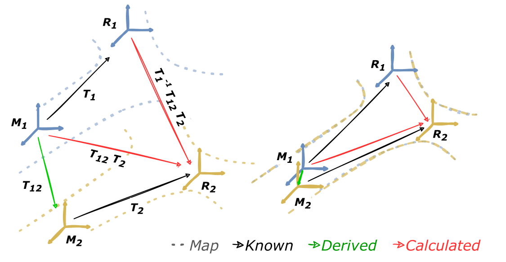
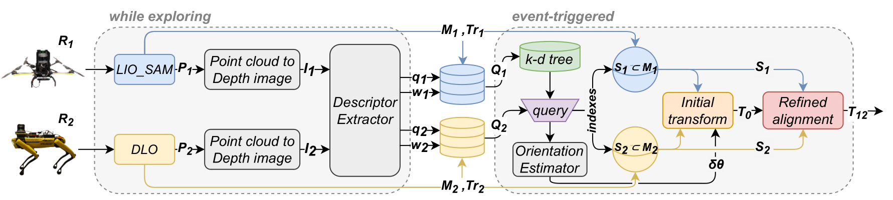

# FRAME: A Modular Framework for Autonomous Map-merging: Advancements in the Field

**Under construction...**

.

.

.

.

.

.

.

**FRAME** is a fast and robust autonomous map-merging framework for multi-agent systems that aims to assist multi-robot exploration missions.



## System Architecture



## How to Install

### Dependencies

## How to Use

### Parameters

## Acknowledgement

If you found this work useful, please cite as follows:

```
@INPROCEEDINGS{stathoulopoulos2023frame,  
    author={Stathoulopoulos, Nikolaos and Koval, Anton and Agha-mohammadi, Ali-akbar and Nikolakopoulos, George},
    booktitle={2023 IEEE International Conference on Robotics and Automation (ICRA)},
    title={{FRAME: Fast and Robust Autonomous 3D Point Cloud Map-Merging for Egocentric Multi-Robot Exploration}},
    year={2023},
    volume={},
    number={},
    pages={3483-3489},
    doi={10.1109/ICRA48891.2023.10160771}
}

@misc{stathoulopoulos2024frame,
      title={{FRAME: A Modular Framework for Autonomous Map-merging: Advancements in the Field}},
      author={Nikolaos Stathoulopoulos and Björn Lindqvist and Anton Koval and Ali-akbar Agha-mohammadi and George Nikolakopoulos},
      year={2024},
      eprint={2404.18006},
      archivePrefix={arXiv},
      primaryClass={cs.RO}
}
```
